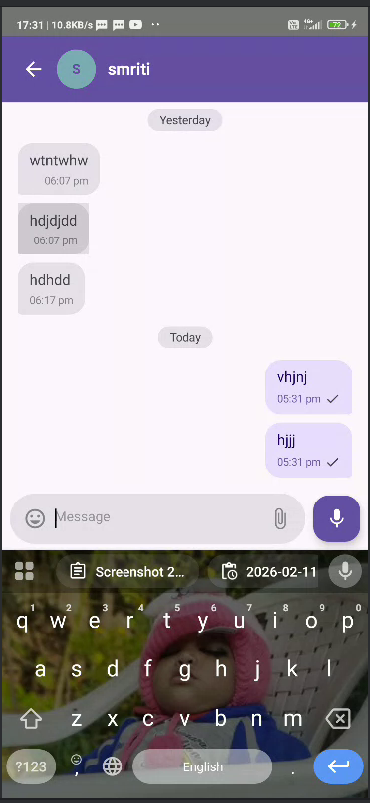
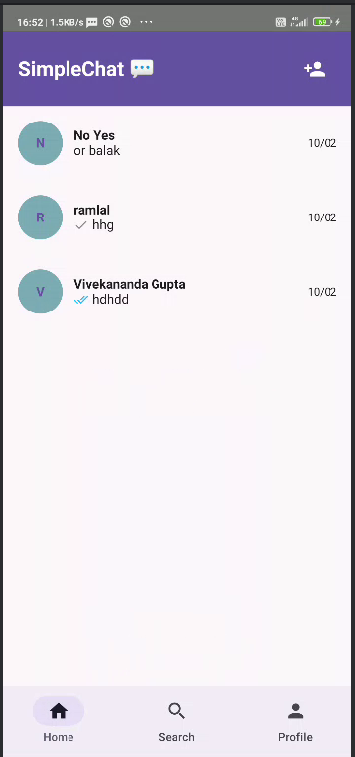
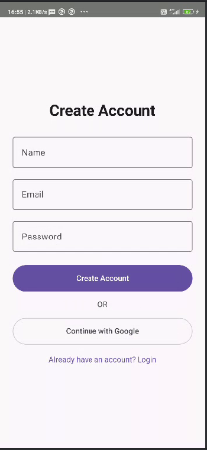
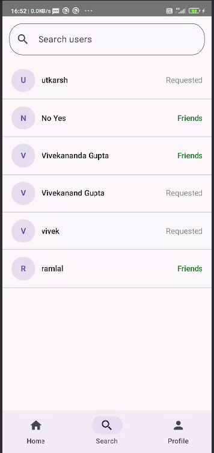
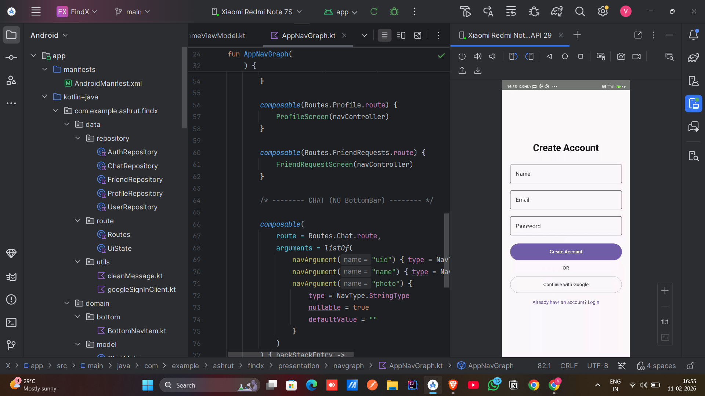

# FindX 💬

A modern real-time chat application built using Jetpack Compose and Firebase.

---

## 📱 App Screenshots

### 🔐 Login Screen
User can securely login using Firebase Authentication.

---

### 💬 Chat Screen
Real-time one-to-one messaging using Firebase Firestore.

---

### 🏠 Home Screen
Displays list of users and active conversations.

### 📝 Signup Screen
New users can create an account securely using Firebase Authentication.  
The app validates user input and stores user data safely in Firestore.

---

### 👥 Users Screen
Displays a list of all registered users except the current user.  
Users can view profiles and start a real-time chat instantly.

---

### 🤝 Friend Requests
Users can send and receive friend requests.  
Incoming and outgoing requests are managed efficiently using Firestore.

---

### 💬 Real-Time Chat
One-to-one real-time messaging system built using Firebase Firestore.  
Messages update instantly with a smooth Jetpack Compose UI.

